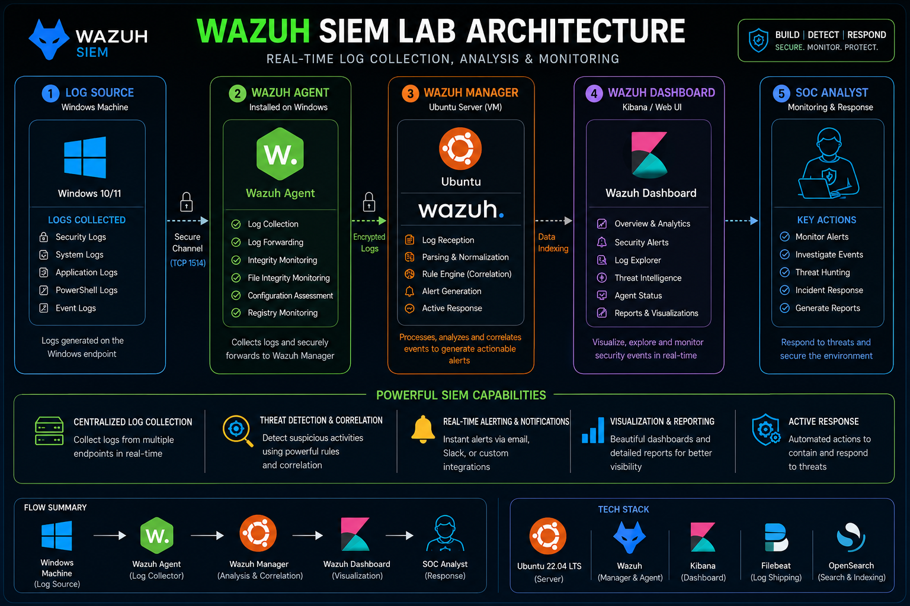
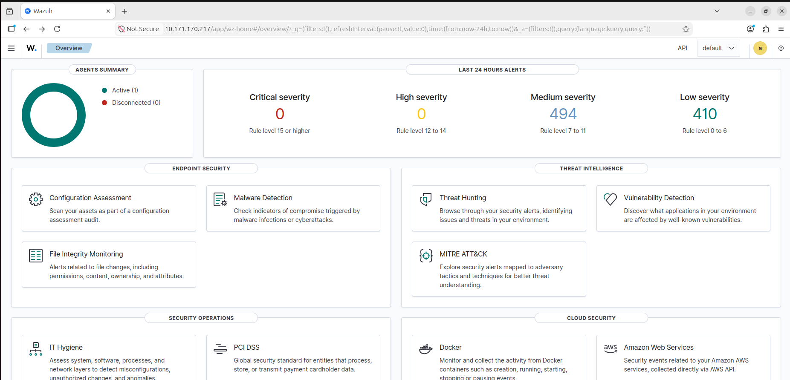
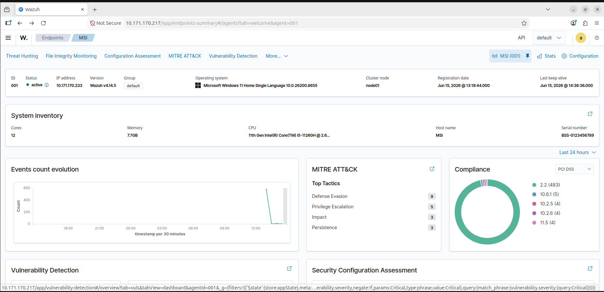
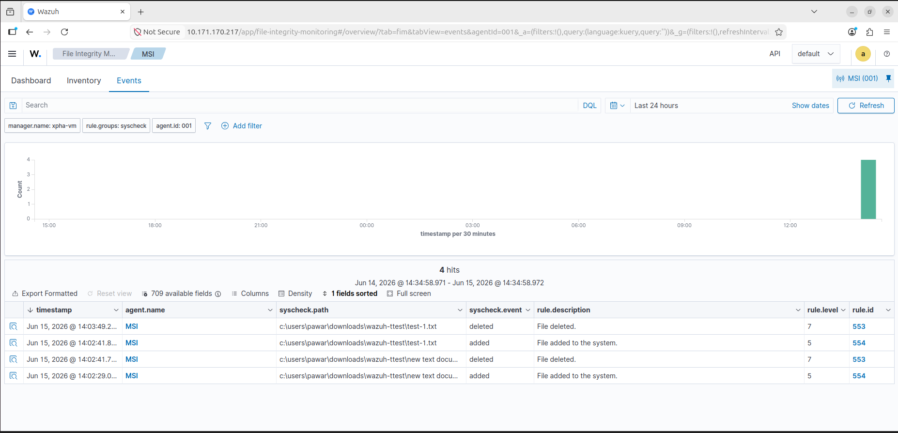

# 🛡️ Wazuh SIEM Lab – Windows to Ubuntu Log Monitoring

## 📌 Project Overview

This project demonstrates a Security Information and Event Management (SIEM) lab built using Wazuh.

The lab collects Windows event logs through a Wazuh Agent and securely forwards them to an Ubuntu-based Wazuh server for centralized monitoring, analysis, and alert generation.

This project was built to gain hands-on experience with Security Operations Center (SOC) workflows and real-time security monitoring.

---

## 🎯 Objectives

- Centralize Windows event logs
- Monitor security events in real time
- Generate security alerts
- Visualize logs through a dashboard
- Understand SIEM architecture
- Gain practical SOC analyst experience

---

## 🏗️ Architecture

Windows Machine

↓

Wazuh Agent

↓

Ubuntu Wazuh Manager

↓

Wazuh Dashboard

↓

SOC Analyst

---

## ⚙️ Environment Setup

| Component | Technology |
|-----------|------------|
| Host Machine | Windows 10/11 |
| Virtualization | VirtualBox |
| Guest Operating System | Ubuntu |
| SIEM Platform | Wazuh |
| Dashboard | Wazuh Dashboard |
| Search & Indexing | OpenSearch |

---

## 🔄 Workflow

### 1. Windows Machine (Log Source)

The Windows endpoint generates different types of logs:

- Security Logs
- Event Logs
- System Logs
- Application Logs
- PowerShell Logs

---

### 2. Wazuh Agent

The Wazuh Agent is installed on the Windows machine.

Responsibilities:

- Log Collection
- Log Forwarding
- Integrity Monitoring
- File Integrity Monitoring
- Configuration Assessment
- Registry Monitoring

---

### 3. Wazuh Manager (Ubuntu VM)

The Wazuh Manager receives and processes logs.

Functions:

- Log Reception
- Parsing & Normalization
- Rule Engine (Correlation)
- Alert Generation
- Active Response

---

### 4. Wazuh Dashboard

The dashboard provides visibility into security events.

Features:

- Overview & Analytics
- Security Alerts
- Log Explorer
- Threat Intelligence
- Agent Status
- Reports & Visualizations

---

### 5. SOC Analyst Activities

Security monitoring tasks include:

- Monitor Alerts
- Investigate Events
- Threat Hunting
- Incident Response
- Generate Reports

---

## 🚀 SIEM Capabilities

- Centralized Log Collection
- Threat Detection & Correlation
- Real-Time Alerting
- Visualization & Reporting
- Active Response

---

## 🛠️ Skills Demonstrated

- SIEM Fundamentals
- Log Analysis
- Security Monitoring
- Event Correlation
- Linux Administration
- Windows Security Monitoring
- SOC Operations

---

## 📸 Project Screenshots

## 📊 Dashboard Overview

## 🖥️ Connected Agent

## 🚨 Security Alerts

---

## 📚 Learning Outcomes

Through this project, I gained hands-on experience in:

- Building a SIEM lab environment
- Collecting and analyzing logs
- Understanding SOC workflows
- Monitoring endpoint activities
- Investigating security events

---

## 🔮 Future Improvements

- Add multiple endpoints
- Integrate Sysmon
- Create custom detection rules
- Build threat-hunting scenarios
- Simulate attack events

---

## 📄 License

This project is created for educational and cybersecurity learning purposes.
